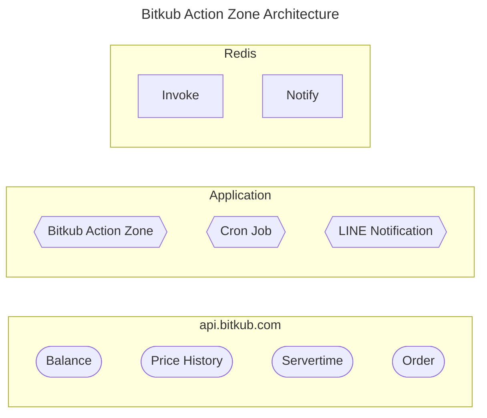
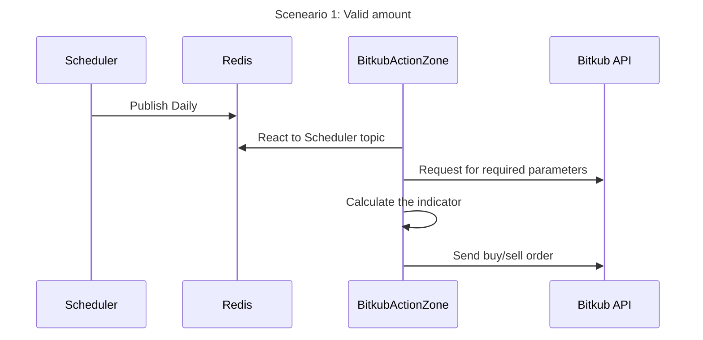
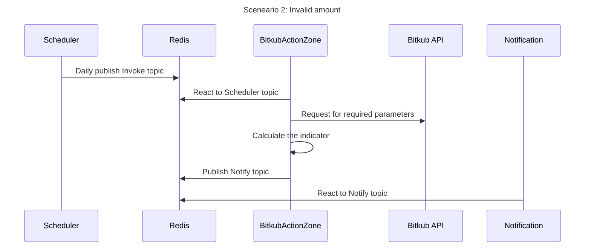

```mermaid
---
title: Bitkub Action Zone Architecture
---
graph LR;

subgraph "api.bitkub.com"
    Api_Bitkub_Balance(["Balance"])
    Api_Bitkub_History(["Price History"])
    Api_Bitkub_Servertime(["Servertime"])
    Api_Bitkub_Transaction(["Order"])
end

subgraph Application 
    Component_BitkubActionZone{{"Bitkub Action Zone"}}
    Component_Scheduler{{"Cron Job"}}
    Component_Notification{{"LINE Notification"}}
end

subgraph Redis
    Redis_Topic_1["Invoke"]
    Redis_Topic_2["Notify"]
end
```

```mermaid
sequenceDiagram
    title Sceneario 1: Valid amount
    Scheduler ->> Redis: Publish Daily
    BitkubActionZone ->> Redis: React to Scheduler topic
    BitkubActionZone ->> Bitkub API: Request for required parameters
    BitkubActionZone ->> BitkubActionZone: Calculate the indicator
    BitkubActionZone->>Bitkub API: Send buy/sell order
```

```mermaid
sequenceDiagram
    title Sceneario 2: Invalid amount
    Scheduler ->> Redis: Daily publish Invoke topic
    BitkubActionZone ->> Redis: React to Scheduler topic
    BitkubActionZone ->> Bitkub API: Request for required parameters
    BitkubActionZone ->> BitkubActionZone: Calculate the indicator
    BitkubActionZone ->> Redis: Publish Notify topic
    Notification ->> Redis: React to Notify topic
```